# leetcode Hot 100
## 目录
- [leetcode Hot 100](#leetcode-hot-100)
  - [目录](#目录)
- [1.两数之和【哈希表】](#1两数之和哈希表)
- [ans:](#ans)
- [141.环形链表\[快慢指针\]](#141环形链表快慢指针)
- [160.相交链表【双指针法】](#160相交链表双指针法)
- [206.反转链表【经典三指针】](#206反转链表经典三指针)
- [234.回文链表【快慢指针+反转链表】](#234回文链表快慢指针反转链表)
  - [200.岛屿数量](#200岛屿数量)
- [62.不同路径【DP/数学组合公式】](#62不同路径dp数学组合公式)
- [第一种思路 动态规划](#第一种思路-动态规划)
- [第二种思路](#第二种思路)
- [第三种思路](#第三种思路)
- [56.合并区间](#56合并区间)
- [560.和为K的子数组](#560和为k的子数组)
- [198.打家劫舍【DP】](#198打家劫舍dp)
- [994.腐烂的橘子 【BFS】](#994腐烂的橘子-bfs)
- [3.无重复字符的最长子串【滑动窗口】](#3无重复字符的最长子串滑动窗口)
# 1.两数之和【哈希表】
给定一个整数数组 nums 和一个整数目标值 target，请你在该数组中找出 和为目标值 target  的那 两个 整数，并返回它们的数组下标。

你可以假设每种输入只会对应一个答案，并且你不能使用两次相同的元素。

你可以按任意顺序返回答案。

 

示例 1：

输入：nums = [2,7,11,15], target = 9
输出：[0,1]
解释：因为 nums[0] + nums[1] == 9 ，返回 [0, 1] 。

示例 2：

输入：nums = [3,2,4], target = 6
输出：[1,2]
# ans:
```cpp
class Solution {
public:
    vector<int> twoSum(vector<int>& nums, int target) {
        //空哈希表
        unordered_map<int,int> hash;
        for(int i=0;i<nums.size();i++){
            int com=target-nums[i];
            //find去找key，找到答案直接返回
            if(hash.find(com)!=hash.end()){
                return {hash[com],i};
            }
            hash[nums[i]]=i;
        }
        return {};
    }
};
```
# 141.环形链表[快慢指针]
给你一个链表的头节点 head ，判断链表中是否有环。

如果链表中有某个节点，可以通过连续跟踪 next 指针再次到达，则链表中存在环。 为了表示给定链表中的环，评测系统内部使用整数 pos 来表示链表尾连接到链表中的位置（索引从 0 开始）。注意：pos 不作为参数进行传递 。仅仅是为了标识链表的实际情况。

如果链表中存在环 ，则返回 true 。 否则，返回 false 。

示例 1：

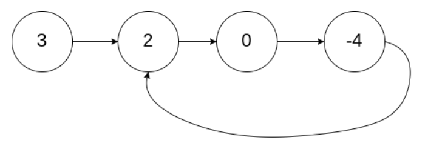

输入：head = [3,2,0,-4], pos = 1
输出：true
解释：链表中有一个环，其尾部连接到第二个节点。

示例 2：

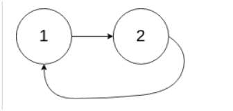

输入：head = [1,2], pos = 0
输出：true
解释：链表中有一个环，其尾部连接到第一个节点。
```cpp
/*
快慢指针
1.设置指针：
    ￮设置两个指针，一个称为慢指针（slow），另一个称为快指针（fast）。
    ￮它们都从链表的头节点（head）开始。
2.移动规则：
    ￮慢指针每次向前移动一步（slow = slow.next）。
    ￮快指针每次向前移动两步（fast = fast.next.next）。
3.判断逻辑：
    ￮如果链表中没有环： 快指针会首先到达链表的末尾（即 fast 或 fast.next 变成 null）。在这种情况下，我们可以确定链表不是环形链表，返回 false。
    ￮如果链表中有环：
        ▪想象在一个圆形跑道上，一个跑得快的人（快指针）和一个跑得慢的人（慢指针）。
        ▪由于快指针移动速度是慢指针的两倍，当它们都进入环后，快指针最终一定会追上慢指针。
        ▪当 slow 和 fast 最终相遇（即 slow == fast）时，我们可以确定链表是环形链表，返回 true。*/
class Solution {
public:
    bool hasCycle(ListNode *head) {
        if(head==nullptr || head->next==nullptr)return false;
        ListNode *fast=head;
        ListNode *slow=head;
        while(fast!=nullptr && fast->next!=nullptr){
            fast=fast->next->next;
            slow=slow->next;
            if(slow==fast) return true;
        }
        return false;
    }
};
```
# 160.相交链表【双指针法】
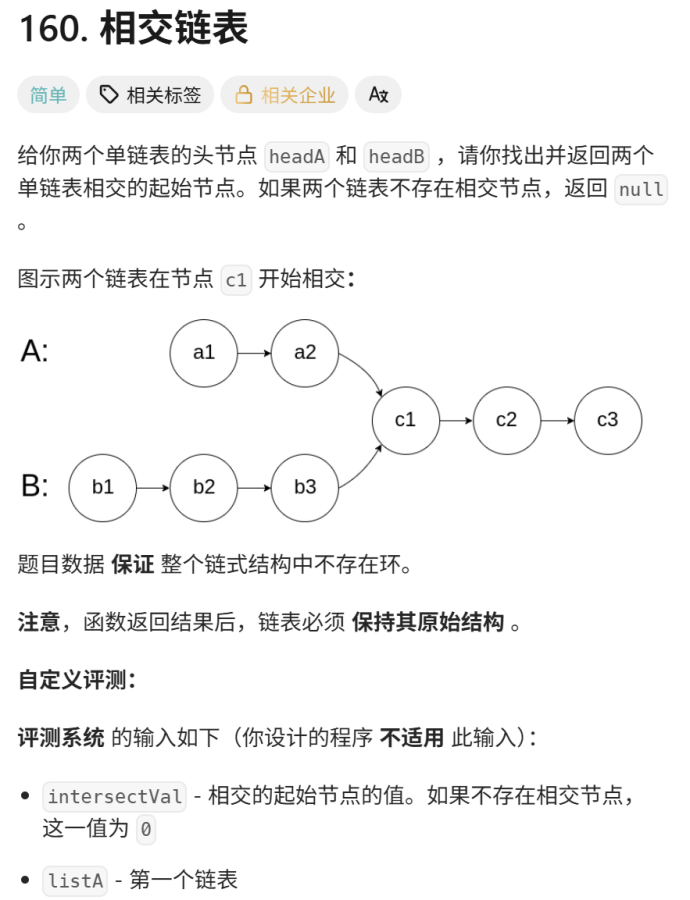
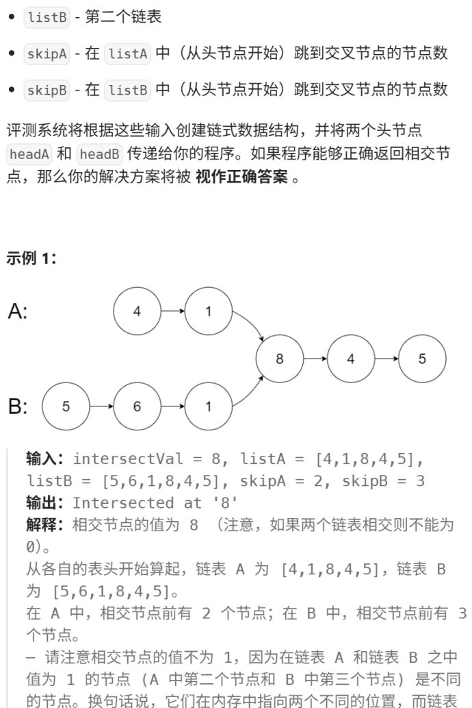
```cpp
/**
 * Definition for singly-linked list.
 * struct ListNode {
 *     int val;
 *     ListNode *next;
 *     ListNode(int x) : val(x), next(NULL) {}
 * };
 */
 /*思路是
•LA=a+c
•LB=b+c
目标：找到相交点 C。
方法：创建两个指针 pA 和 pB，分别从链表 A 和链表 B 的头节点开始遍历。
1.第一轮遍历：
pA 走完链表 A 后（走到 null），将其重新指向链表 B 的头节点。
pB 走完链表 B 后（走到 null），将其重新指向链表 A 的头节点。
2.第二轮遍历：
￮在它们重新指向后，让它们继续向前移动。
关键洞察：当 pA 重新指向 B 链表，且 pB 重新指向 A 链表时：
•指针 pA 走过的总距离是：LA+LB=(a+c)+b
•指针 pB 走过的总距离是：LB+LA=(b+c)+a
由于 a+c+b=b+c+a，所以两个指针走过的总距离是相等的。*/
class Solution {
public:
    ListNode *getIntersectionNode(ListNode *headA, ListNode *headB) {
        if(headA==nullptr ||headB==nullptr) return nullptr;
        ListNode * p=headA;
        ListNode * q=headB;
        while(p!=q){
            p=p==nullptr?headB:p->next;
            q=q==nullptr?headA:q->next;

        }
        /*•如果链表相交，它们最终会在相交节点处相遇。
          •如果链表不相交（即 c=0），它们会同时在两个链表的末尾 null 处相遇（因为 LA+LB 仍然等于 LB+LA），这时返回 null。*/
        return p;
    }
};
```
# 206.反转链表【经典三指针】
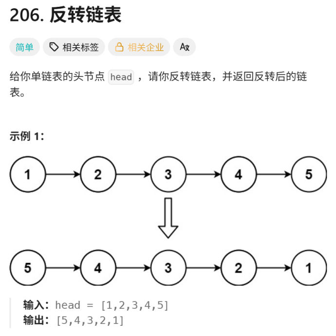
```cpp
/**
 * Definition for singly-linked list.
 * struct ListNode {
 *     int val;
 *     ListNode *next;
 *     ListNode() : val(0), next(nullptr) {}
 *     ListNode(int x) : val(x), next(nullptr) {}
 *     ListNode(int x, ListNode *next) : val(x), next(next) {}
 * };
 */
class Solution {
public:
    ListNode* reverseList(ListNode* head) {
        ListNode * curr=head;
        ListNode * prev=nullptr;
        while(curr!=nullptr){
           ListNode * nextp=curr->next;
           curr->next=prev;
           prev=curr;
           curr=nextp;
        }
        return prev;
    }
};
```
# 234.回文链表【快慢指针+反转链表】
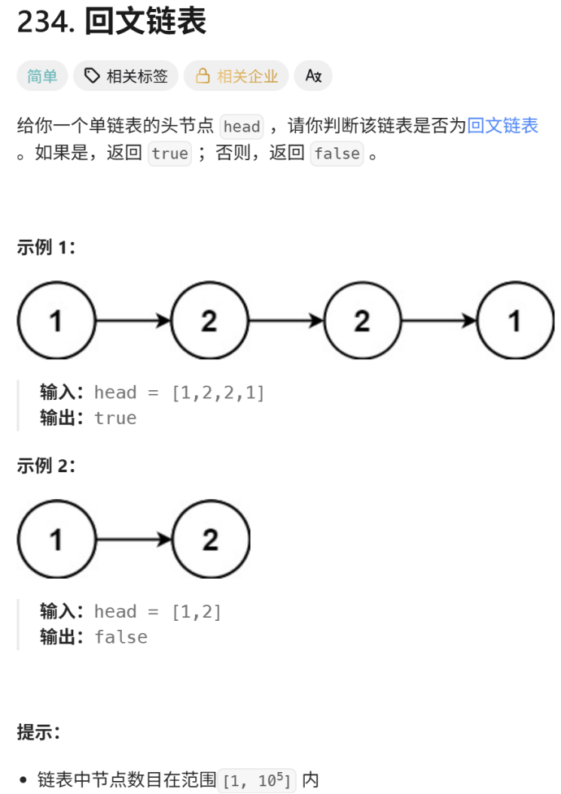
```cpp
/**
 * Definition for singly-linked list.
 * struct ListNode {
 *     int val;
 *     ListNode *next;
 *     ListNode() : val(0), next(nullptr) {}
 *     ListNode(int x) : val(x), next(nullptr) {}
 *     ListNode(int x, ListNode *next) : val(x), next(next) {}
 * };
 */
class Solution {
private:
    ListNode *rev(ListNode *head){
        ListNode * curr=head;
        ListNode * prev=nullptr;
        while(curr!=nullptr){
            ListNode * nextp=curr->next;
            curr->next=prev;
            prev=curr;
            curr=nextp;
        }
        return prev;
    }
public:
    bool isPalindrome(ListNode* head) {
        if(head==nullptr || head->next==nullptr) return true;
        ListNode * fast=head;
        ListNode * slow=head;
        while(fast->next!=nullptr && fast->next->next!=nullptr){
            fast=fast->next->next;
            slow=slow->next;
        }
        ListNode * rig=rev(slow->next);
        slow->next=nullptr;
        ListNode *p=head;
        ListNode *q=rig;
        bool res=true;
        while(q!=nullptr){  
            if(p->val != q->val){
                res=false;
                break;
            }
            q=q->next;
            p=p->next;
        }
        slow->next=rev(rig);
        return res;
    }
};
```
## 200.岛屿数量
```cpp
//bfs，当前位置是1，发现新岛屿，然后找到和当前位置所有相连的地，上下左右找周围，将所有刚刚找到的同伴计入queue来扩大势力，去找同伴的同伴，每次bfs结束会找到一个完整的岛屿
4 4
1 0 0 0
0 0 1 1
1 0 0 0
1 0 0 1
#include<bits/stdc++.h>
using namespace std;
//bfs 广度优先搜索
int grid[100][100],vis[100][100],m,n;
int dir[4][2]={{1,0},{-1,0},{0,1},{0,-1}};
void bfs(int i,int j){
    queue<pair<int,int>> q;
    q.push(make_pair(i,j));
    while(!q.empty()){
        int x=q.front().first,y=q.front().second;
        q.pop();
        for(int i=0;i<4;i++){
            int curx=x+dir[i][0],cury=y+dir[i][1];
            if(curx<0||curx>=m||cury<0||cury>=n) continue;
            if(grid[curx][cury]==0) continue;
            if(vis[curx][cury]==1) continue;
            q.push(make_pair(curx,cury));
            vis[curx][cury]=1;
        }
    }
}
int main(){
    int ans=0;
    cin>>m>>n;
    for(int i=0;i<m;i++){
        for(int j=0;j<n;j++){
            cin>>grid[i][j];
            vis[i][j]=0;
        }
    }
    for(int i=0;i<m;i++){
        for(int j=0;j<n;j++){
            if(grid[i][j]==1 && vis[i][j]==0){
                bfs(i,j);
                ans++;
                vis[i][j]=1;
            }
        }
    }
    cout<<ans;
    return 0;
}

```
```cpp
//dfs 深度优先搜索
#include<bits/stdc++.h>
using namespace std;
int m,n;
int grid[100][100];
//dfs，一条路走到黑，当前位置是1，发现新岛屿，然后上下左右方向分别找完所有的同伴即为一个完整岛屿
//四个方向都走到尽头，目的是记录岛屿数，岛屿直接淹没变为0
void dfs(int i,int j){
    if(i<0||i>=m||j<0||j>=n||grid[i][j]==0) return;
    grid[i][j]=0;
    dfs(i+1,j);
    dfs(i-1,j);
    dfs(i,j+1);
    dfs(i,j-1); 
}
int main(){
    cin>>m>>n;
    for(int i=0;i<m;i++){
        for(int j=0;j<n;j++){
            cin>>grid[i][j];
        }
    }
    int ans=0;
    for(int i=0;i<m;i++){
        for(int j=0;j<n;j++){
            if(grid[i][j]==1){
                ans++;
                dfs(i,j);
            }
        }
    }
    cout<<ans;
    return 0;
}
```
# 62.不同路径【DP/数学组合公式】
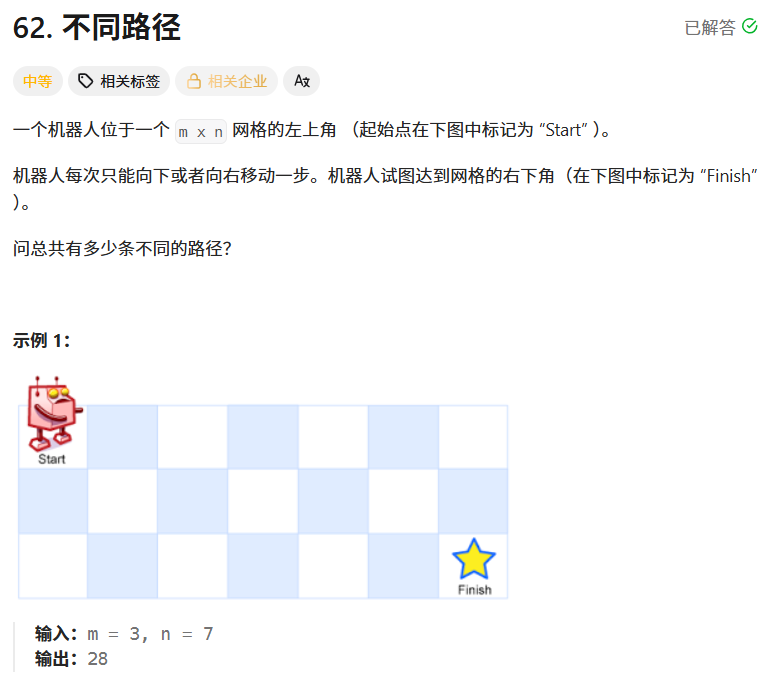
（i，j）只会从（i-1, j）和（i, j-1）走到
# 第一种思路 动态规划
```cpp
#include<bits/stdc++.h>
using namespace std;
int main(){
    int m,n;
    cin>>m>>n;
    int dp[100][100];
    for(int i=0;i<m;i++){
        for(int j=0;j<n;j++){
            if(i==0||j==0) dp[i][j]=1;
            else dp[i][j]=dp[i-1][j]+dp[i][j-1];
        }
    }
    cout<<dp[m-1][n-1];
    return 0;
}
```
# 第二种思路 
机器人从左上角走到右下角：
网格 m 行 n 列
必须向下走 m-1 步，向右走 n-1 步
总步数：total = (m-1)+(n-1) = m+n-2

问题等价于：一共 total 步，从中选出 m-1 步向下（剩下自动向右），求组合数公式：
$$C_{total}^{k} = \frac{total!}{k!\cdot (total-k)!}$$
组合数递推写法：
$$C_{t}^{k} = \prod_{i=1}^{k}\frac{t-k+i}{i}$$
为什么可以直接先乘后除不会出现小数？
组合数结果一定是整数，每一轮乘法之后，必然能被 i 整除，不会产生浮点数误差。
使用long long防止中间数值溢出。
```cpp
class Solution {
public:
    int uniquePaths(int m, int n) {
        int total=m+n-2;
        //取小减少运算
        int k=min(m-1,n-1);
        long long res=1;
        for(int i=1;i<=k;i++){
            res=res*(total-k+i)/i;
        }
        return (int)res;
    }
};
```
# 第三种思路
我们按「从上到下、每行从左向右」遍历

计算 dp[j] 的时候：

未修改的dp[j]保存上一行数据（来自上方）

dp[j-1]在本轮循环已经更新，保存本行左侧数据；
直接原地覆盖，不需要额外开辟二维空间，实现滚动复用
```cpp
int uniquePaths(int m, int n) {
    if(m < n) swap(m,n);
    vector<int> dp(n,1);
    for(int i=1;i<m;i++){
        for(int j=1;j<n;j++){
            dp[j] += dp[j-1];
        }
    }
    return dp.back();
}
```
# 56.合并区间
结构体PAIR 重载比较操作 operator <
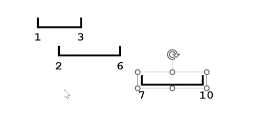
```cpp
//先按照左区间从大到小排序，后续只需要比较后面坐标的左区间是否在当前区间范围内，重叠就合并，不重叠就结束现有的区间合并，把当前的作为新的
#include<bits/stdc++.h>
using namespace std;
int ans[100][2];
struct PAIR{
    int x,y;
    bool operator<(const PAIR &a)const{
        if(x==a.x) return y<a.y;
        return x<a.x;
    }
}a[1005];
int main(){
    int n;
    cin>>n;
    for(int i=0;i<n;i++){
        cin>>a[i].x>>a[i].y;
    }
    sort(a,a+n);
    int m=0;
    int l=a[0].x,r=a[0].y;
    for(int i=1;i<n;i++){
        if(a[i].x<=r){
            r=max(a[i].y,r);
        }else{
            m++;
            ans[m][0]=l;
            ans[m][1]=r;
            l=a[i].x;
            r=a[i].y;
        }
    }
    m++;
    ans[m][0]=l;
    ans[m][1]=r;
    for(int k=1;k<=m;k++){
        cout<<ans[k][0]<<' '<<ans[k][1]<<endl;
    }
    return 0;
}
```
# 560.和为K的子数组
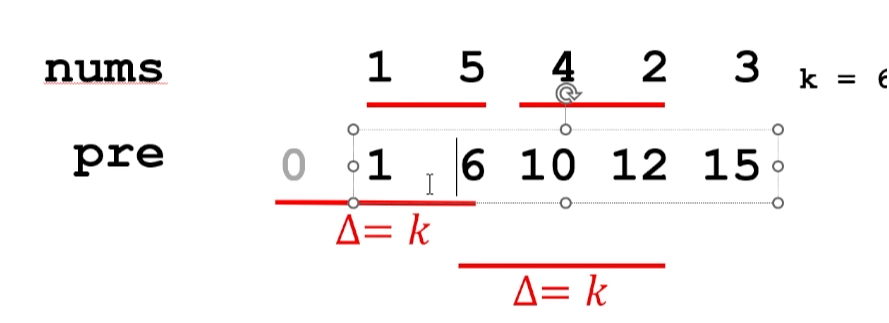
pre[j]=pre[i-1]+k

pre[i-1]=pre[j]-k
找以j结尾的所有符合条件的起点
```cpp
//计算前缀和，定义map<前缀和，该数值出现的次数> 主要是因为数组中可能会有负数，导致某个前缀和数会出现多次，如果是单调的数列，那前缀和会是唯一的，现在不是
//去找pre-k的次数，即找以R为右区间的 起点的个数
class Solution {
public:
    int subarraySum(vector<int>& nums, int k) {
        //count[0]=1,前缀和为0至少出现一次
        unordered_map<int,int> count;
        count[0]=1;
        int pre=0,ans=0;
        for(int num:nums){
            pre+=num;
            if(count.find(pre-k)!=count.end()){
                ans+=count[pre-k];
            }
            count[pre]++;
        }
        return ans;
    }
};
```
```cpp
#include<bits/stdc++.h>
using namespace std;
int main(){
    int n,k;
    cin>>n>>k;
    vector<int> nums(n);
    for(int i=0;i<n;i++){
        cin>>nums[i];
    }
    vector<int> pre(n+1,0);
    for(int i=1;i<=n;i++){
        pre[i]=pre[i-1]+nums[i-1];
    }
    unordered_map<int,int> mp;
    int ans=0;
    for(int i=0;i<=n;i++){
        if(mp.find(pre[i]-k)!=mp.end()){
            ans+=mp[pre[i]-k];
        }
        mp[pre[i]]++;
    }
    cout<<ans;
    return 0;
}
```
# 198.打家劫舍【DP】
动态规划，选当前，不选当前（要求是不能连续打劫 所能偷盗的最大价值）
```cpp
class Solution {
public:
    int rob(vector<int>& nums) {
        int prev1=0,prev2=0;
        for(int x:nums){
            int cur=max(prev1,prev2+x);
            prev2=prev1;
            prev1=cur;
        }
        return prev1;
    }
};
```
```cpp
#include<bits/stdc++.h>
using namespace std;
int main(){
    int n;
    cin>>n;
    vector<int> nums(n);
    for(int i=0;i<n;i++){
        cin>>nums[i];
    }
    int dp[100][100];
    dp[0]=nums[0];
    dp[1]=max(nums[0],nums[1]);
    for(int i=2;i<n;i++){
        dp[i]=max(dp[i-1],dp[i-2]+nums[i]);
    }
    cout<<dp[n-1];
    return 0;
}
```
# 994.腐烂的橘子 【BFS】
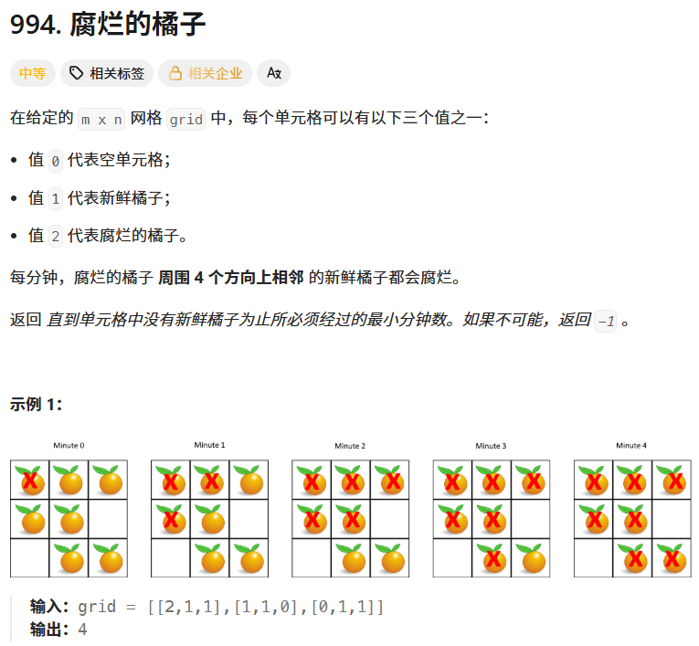
腐烂是一层一层同步扩散，适合BFS

q[0]存放当前这一轮需要往外传染的腐烂橘子坐标

q[1]存放本轮传染中新腐烂的橘子，留给下一轮继续扩散

state切换当前正在使用哪一个队列的标记

state=0现在处理q[0]里的橘子

state^=1 0 变 1、1 变 0，切换队列，用 state 异或只是精简写法，省去if(state==0) 的判断代码
```cpp
//核心bfs
while(!q[0].empty()||!q[1].empty()){
    ans++;
    while(!q[state].empty()){
        int cx=q[state].front().first,cy=q[state].front.second;
        q[state].pop();
        //坐标不合法 continue；
        //当前新鲜 感染
        if(grid[cx][cy]==1){
            grid[cx][cy]==2;
            q[state^1].push(make_pair(cx,cy));
            --fresh;
        }
    }
    state^=1;
}
```
```cpp
#include<bits/stdc++.h>
using namespace std;
int grid[100][100];
int dir[4][2]={{1,0},{-1,0},{0,1},{0,-1}};
int main(){
    int m;
    int n;
    int fresh=0,state=0;
    queue<pair<int,int>> q[2];
    cin>>m>>n;
    for(int i=0;i<m;i++){
        for(int j=0;j<n;j++){
            cin>>grid[i][j];
            if(grid[i][j]==1) fresh++;
            if(grid[i][j]==2) q[state].push(make_pair(i,j));
        }
    }
    if(fresh==0){
        cout<<0;
        return 0;
    }
    int ans=0;
    //说明还有橘子可以感染
    while(!q[0].empty()||!q[1].empty()){
        //进入新一轮感染
        ans++;
        while(!q[state].empty()){
            int x=q[state].front().first,y=q[state].front().second;
            q[state].pop();
            for(int i=0;i<4;i++){
                int curx=x+dir[i][0],cury=y+dir[i][1];
                if(curx<0||curx>=m||cury<0||cury>=n) continue;
                if(grid[curx][cury]==1) {
                    //标记为腐烂，防止重复bfs
                    grid[curx][cury]=2;
                    //扔进另一个队列，下一轮由它进行感染
                    q[state^1].push(make_pair(curx,cury));
                    fresh--;
                }
            }
        }
        state^=1;
    }
    //循环完无法腐烂，左下角的橘子永远不会腐烂，因为腐烂只会发生在 4 个方向上。

    /*
    3 3
    2 1 1
    0 1 1
    1 0 1
    */
    if(fresh>0) cout<<-1<<endl;
    else cout<<ans-1;
    return 0;
}
```
# 3.无重复字符的最长子串【滑动窗口】
考虑在常数级别解决

l,r 初始化0
每次移动r，更新 l , r 指向的子串的各个字符种类数量，如果没有重复就继续移动右指针（每次看右指针所指的是不是重复出现的字符就可以）
如果出现了重复字符，移动左指针，直到重复的字符不重复

每次更新最长子串长度
字符映射到ASCII码上
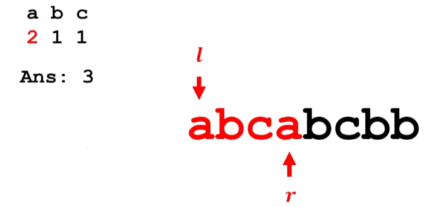
```cpp
#include<bits/stdc++.h>
using namespace std;
int cnt[512]={0};
int main(){
    string s;
    cin>>s;
    int ans=0;
    int l=0,r=0;
    cnt[s[0]]++;
    while(r<s.length()-1){
        r++;
        cnt[s[r]]++;
        if(cnt[s[r]]>1){
            while(l<r && cnt[s[r]]>1){
                cnt[s[l]]--;
                l++;
            }
        }
        ans=max(ans,r-l+1);
    }
    cout<<ans;
    return 0;
}
```
